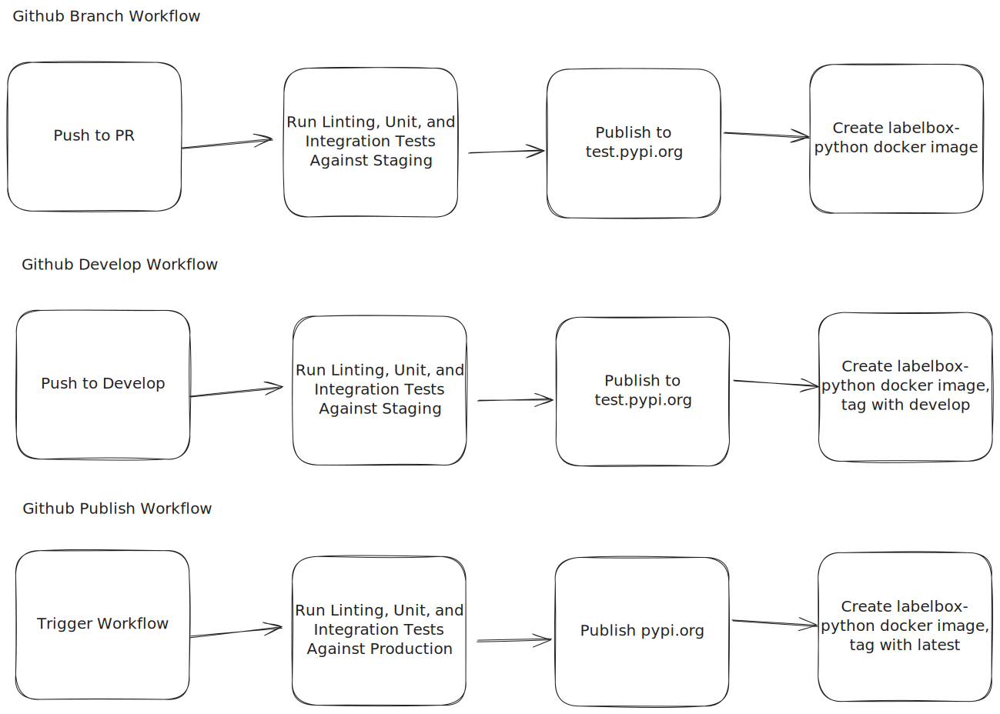

# Contribution Guide

The repository is laid out as a monorepo where each moudle in the monorepo lives as a folder in `libs/`. Each module should have a `README.md` describing the specific purpose of the module and its development requirements. 

This is a general guide applicable to all modules in the repository.

## Table of Contents

- [General Guidelines](#general-guidelines)
- [Branches](#branches-and-tags)
- [Release Steps](#release-steps)
- [Jupyter Notebooks](#jupyter-notebooks)
- [General Prerequisites](#general-prerequisites)
- [Setup and Building](#setup-and-building)
- [Testing](#testing)

## General Guidelines

Thank you for expressing your interest in contributing! To ensure that your contribution aligns with our guidelines, please carefully review the following before proceeding:

* For feature requests, we recommend consulting with [Labelbox Support](https://docs.labelbox.com/docs/contacting-customer-support) support or creating a [Github Issue](https://github.com/Labelbox/labelbox-python/issues).
* We can only accept general solutions that address common issues rather than solutions designed for specific use cases. Example contributions encompass a wide range of activities, such as bug fixes and updates to dependencies.
* Ensure that any new libraries added are compliant with the Apache license that governs the repository.
* Ensure that you update any relevant docstrings and comments within the code you may add or change.
* Ensure that any new Python components, such as classes, packages, or methods, that need to feature in the Labelbox documentation have entries in the file [index.rst](https://github.com/Labelbox/labelbox-python/blob/develop/docs/source/index.rst).

## Branches and Tags

* All development happens in per-feature branches prefixed by contributor's initials. For example `fs/feature_name`.
* Approved PRs are merged to the `develop` branch.

## Release Steps

Your contributions will be released as soon as it is approved and merged into the `develop` branch. Please consult the [Labelbox](https://docs.labelbox.com/docs/contacting-customer-support) team for if you need a more specific timeframe of when your contributions may be released.

## Github Workflows



The above describes the workflows that currently exist.

* Github Branch Workflow
  * When you push to a branch, it will create a build of the SDK that runs tests against **staging**. It will publish the build to `test.pypi.org` which can be downloaded for testing. Also, a docker image is built which can be used for testing as it has the SDK installed.
* Github Develop Workflow
  * When you push to a `develop` (main branch), it will create a build of the SDK that runs tests against **staging**. It will publish the build to `test.pypi.org` which can be downloaded for testing. Also, a docker image is built which can be used for testing as it has the SDK installed. This docker image is tagged with `develop`.
* Github Publish Workflow
  * When you run the publish workflow, it will create a build of the SDK that runs tests against **production**. It will publish the build to `pypi.org` which is what consumers of the SDK will normally use. Also, a docker image is built which can be used for testing as it has the SDK installed. This docker image is tagged with `latest`.

## General Prerequisites

[Rye](https://rye-up.com/) must be installed before contributing to the repository as it is the tool used to managed the repository. 

To understand why Rye was chosen, see [here](https://alpopkes.com/posts/python/packaging_tools/). TLDR: Environment, Package, Python, management along with Package publishing and Package building is unified under a single tool for consistency of development.

If you want to not deal with setting up `Rye`, feel free to use one of [Docker containers](https://github.com/Labelbox/labelbox-python/pkgs/container/labelbox-python) Labelbox has built which contains the entire with `Rye` setup.

**You can use Poetry to manage the virtual environment.** There's nothing blocking you from using Poetry to manage the virtual environment as the standard `pyproject.toml` format is used, but you'll have to deal with managing Python yourself + be asked not to check in any `poetry.lock` files. Also, you'll have to run equivalent poetry commands that may not be listed in the documentation to perform the same general operations (testing, building, etc.).

## Setup and Building

These are general steps that all modules in `libs/` adhere to given the prerequisite of the installation of `Rye` that are needed to setup a module for development and build it.

* `rye sync` in the module folder you want to work on (EG `rye sync --all-features` to work on `labelbox`).
* `rye build` to create a distribution in `dist/` which you can install into a Python environment (EG `pip install dist/labelbox-build.tar.gz`).

It is generally **not** recommended to do `pip install -e .` with any Labelbox module to avoid virtual environment pollution. If you want to modify any module while making it compatible with your existing `pip` based projects, build a distribution and install it in your `pip` environment.

## Testing

Each module within the repository will generally expected to implement three commands for testing: unit testing, integration testing, and linting/formatting. See the details in each module's `README.md` for more information.

```bash
rye run unit
rye run integration
rye run lint
```

## Documentation

To generate documentation for all modules (`ReadTheDocs`), run the following command.

```bash
rye run docs
```

## Jupyter Notebooks

We have samples in the `examples` directory and using them for testing can help increase your productivity.

Make sure your notebook will use your source code:
1. `ipython profile create`
2. `ipython locate` - will show where the config file is. This is the config file used by the jupyter server, since it runs via ipython
3. Open the file (this should be ipython_config.py and it is usually located in ~/.ipython/profile_default) and add the following line of code: 
```
c.InteractiveShellApp.exec_lines = [
  'import sys; sys.path.insert(0, "<labelbox-python root folder>")'
]
```
4. Go to the root of your project and run `jupyter notebook` to start the server